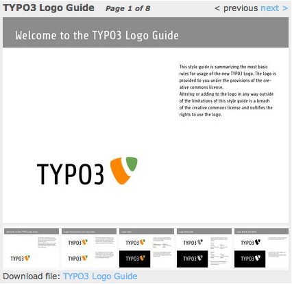

.. ==================================================
.. FOR YOUR INFORMATION
.. --------------------------------------------------
.. -*- coding: utf-8 -*- with BOM.

.. include:: ../Includes.txt

Introduction
============

.. _what-does-it-do:

What does it do?
----------------

This Extension renders a pdf to images that can be viewed directy by your visitor without opening the file - perfect for a preview!

Additionally, all pages (or all set pages) of the pdf file could be rendered and the visitor is able to browse around. The layout of the viewer is highly customizable (for example, the images could be opend in a magnificpopup lightbox).

.. _screenshot:

Screenshot
----------

	Example: The TYPO3 Logo Guide, the first 8 pages are available as preview.

.. _contribute:

Contribute
----------

Feel free to contribute to this extension within GitHub: `https://github.com/jonathanheilmann/ext-jh_pdfviewer
<https://github.com/jonathanheilmann/ext-jh_pdfviewer>`_.