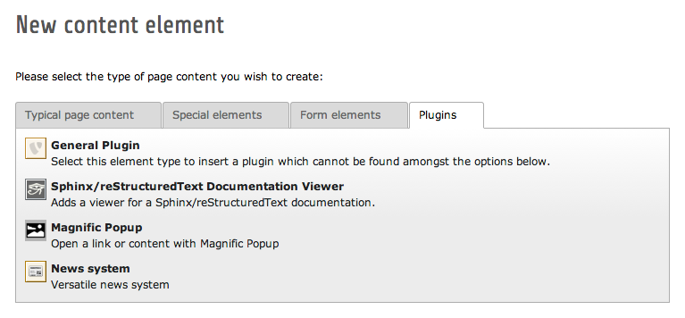
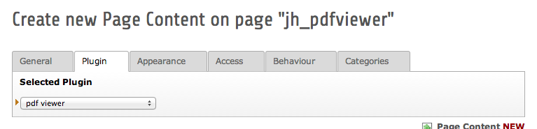
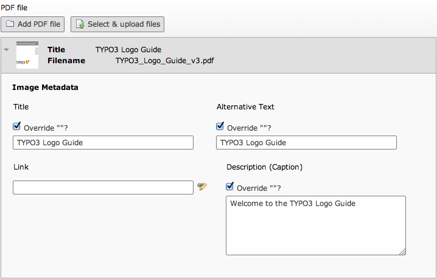
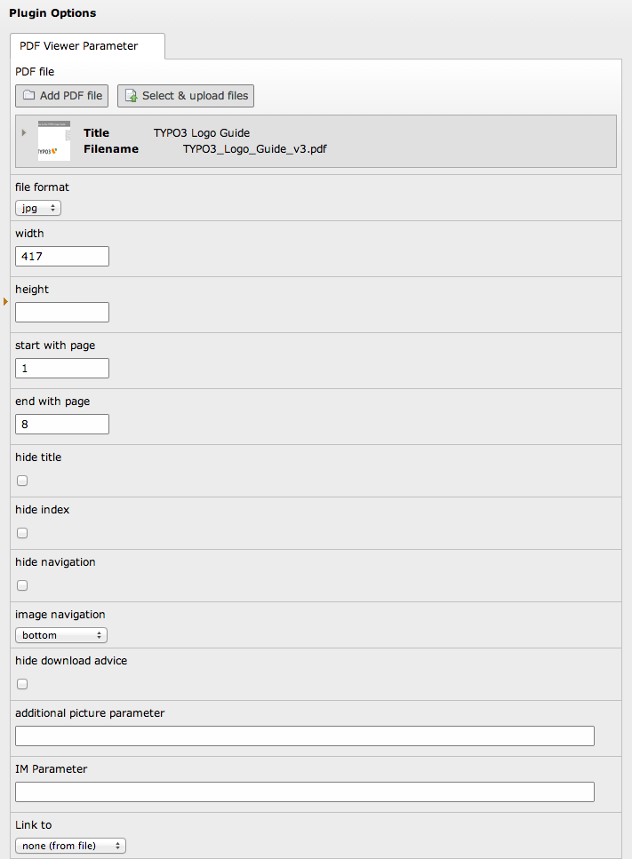
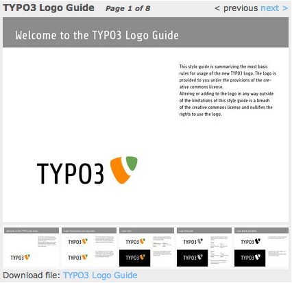

.. ==================================================
.. FOR YOUR INFORMATION
.. --------------------------------------------------
.. -*- coding: utf-8 -*- with BOM.

.. include:: ../Includes.txt

.. _users-manual:

Users manual
============

.. _adding-pdf-viewer:

Adding pdf viewer
-----------------

- Create a new content element and select "General Plugin" in section "Plugins".

- Select plugin "pdf viewer" and save content element.

- Add a pdf file from folder in fileadmin OR select & upload a pdf file you want to display within pdf viewer.
- Optional: set Title, Alternative Text, Link and Description (Caption)

- All further options are optional, some could be set global in TypoScript Constants (see chapter :ref:`configuration` )

.. ### BEGIN~OF~TABLE ###

.. t3-field-list-table::
 :header-rows: 1

 - :field:
 		Field

   :description:
		Description

   :global:
		Global

 - :field:
		file format

   :description:
		Format of the displayed image.

   :global:
		\

 - :field:
		widht

   :description:
		width of displayed image in px.

   :global:
		yes

 - :field:
		height

   :description:
		height of displayed image in px, leave empty to keep aspect ratio.

   :global:
		yes

 - :field:
		start with page

   :description:
		The first page to be displayed, leave empty to start with the first page.

   :global:
		\

 - :field:
		end with page

   :description:
		Last page to be displayed (leve empty if you only want to display one page).

   :global:
		\

 - :field:
		hide title

   :description:
		Hide the title on top of the viewer.

   :global:
		\

 - :field:
		hide index

   :description:
		Hide index if multiple pages are displayed with navigation.

   :global:
		\

 - :field:
		hide navigation

   :description:
		Hide navigation of the pdf viewer.

   :global:
		\

 - :field:
		image navigation

   :description:
		| Display an image navigation with preview-thumbnails:
		| - by Typoscript: use the global setting
		| - disable: disable image navigation
		| - top: display the image navigation on top of the pdf viewer
		| - bottom: display the image navigation at bottom of the pdf viewer

   :global:
		(yes)

 - :field:
		hide download advice

   :description:
		Hide the download advice at bottom of the viewer.

   :global:
		\

 - :field:
		Link to

   :description:
		| Link displayed image to:
		| - none (from file): links the image to the linke given in added pdf file
		| - Link to document: opens the added pdf file in new browser-window
		| - magnificpopup: opens the displayed images in a magnificpopup lightbox

   :global:
		\

.. ###### END~OF~TABLE ######

	Complete configuration of the pdf viewer

	The result in frontend
